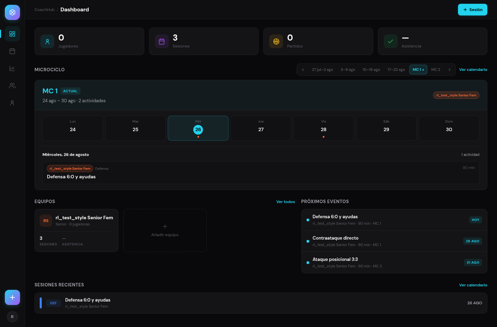
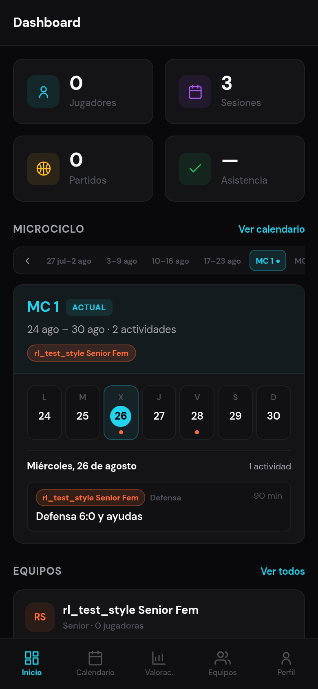
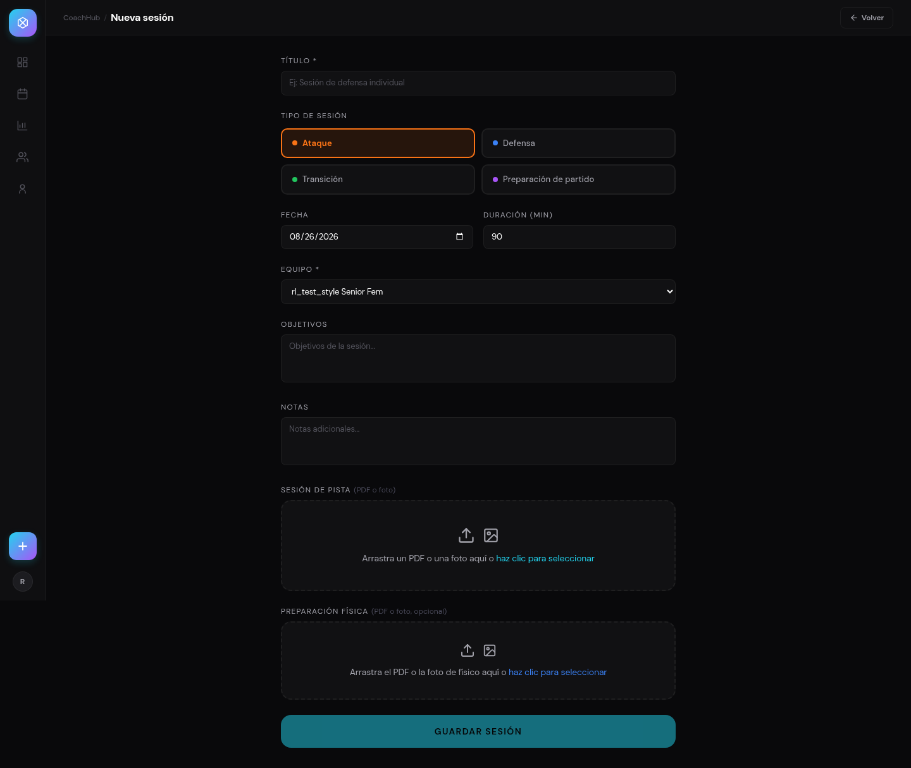
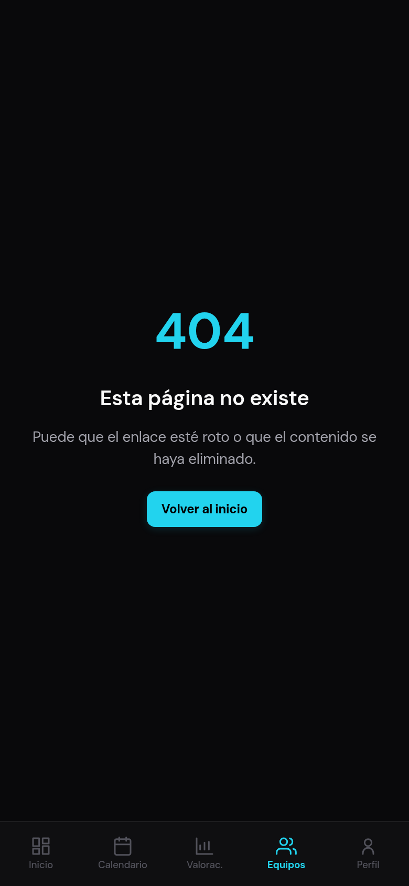

# CoachHub — Guía de estilo visual

Guía para replicar el aspecto de CoachHub en otra app (p. ej. la de altura de salto).
**Todos los valores están extraídos del código real**, no son propuestas.

Fuentes de verdad en el repo:

- `packages/web/src/web/styles.css` → tokens CSS + clases de componente
- `packages/web/src/web/components/icons.tsx` → set de iconos propio
- `packages/web/src/web/components/{BottomNav,Topbar,Panel,StatsStrip}.tsx` → navegación y componentes base

> **Aviso importante sobre móvil.** En este repo `packages/mobile/constants/theme.ts` es **el theme de la plantilla sin tocar** (blanco/negro neutro, `#1F1F1F`, `#E5E5E5`…). CoachHub **no usa ese fichero**: no hay app nativa desarrollada. Lo que se ve en el móvil es **la misma web en responsive** (breakpoint 768 px vía `useIsMobile`). Así que el theme a copiar es el de la web; el `theme.ts` de la plantilla está pegado al final solo para que no lo confundas con estilo de CoachHub.

---

## 1. Tokens de color

### Fichero de tema tal cual (`packages/web/src/web/styles.css`)

```css
/* ==========================================================================
   DASHBOARD PRO — Design tokens
   Herramienta profesional: densidad informacional, navegación icon-first,
   color semántico. Dark mode único (no light mode).
   ========================================================================== */
:root {
  /* Fondos */
  --bg-primary:    #09090b;
  --bg-sidebar:    #0f0f11;
  --bg-secondary:  #111113;
  --bg-surface:    #111113;
  --bg-card:       #141416;
  --bg-card-hover: #1a1a1e;
  --bg-elevated:   #1c1c20;

  /* Acentos */
  --accent:           #22d3ee;
  --accent-light:     #67e8f9;
  --accent-hover:     #67e8f9;
  --accent-dim:       rgba(34,211,238,0.08);
  --accent-glow:      rgba(34,211,238,0.2);
  --accent-secondary: #a855f7;
  --accent-warm:      #fbbf24;
  --accent-orange:    #f97316;
  --accent-blue:      #3b82f6;
  --accent-green:     #22c55e;
  --accent-gradient:  linear-gradient(135deg, #22d3ee, #a855f7);

  /* Texto */
  --text-primary:  #fafafa;
  --text-secondary:#a1a1aa;
  --text-muted:    #52525b;

  /* Bordes */
  --border:        rgba(255,255,255,0.06);
  --border-accent: rgba(34,211,238,0.3);

  /* Estados */
  --success:    #4ade80;
  --danger:     #f87171;
  --danger-dim: rgba(248,113,113,0.08);
  --info:       #60a5fa;
  --warning:    #fbbf24;
  --field-green:#1a6b3a;

  /* Radios */
  --radius-xs: 6px;
  --radius-sm: 8px;
  --radius-md: 12px;
  --radius-lg: 16px;
  --radius-xl: 20px;

  /* Layout */
  --sidebar-w: 72px;
  --topbar-h:  56px;
}
```

### Rol de cada color

| Rol | Token | Hex | Notas |
|---|---|---|---|
| Fondo de pantalla | `--bg-primary` | `#09090b` | Casi negro, ligerísimo tinte frío. Solo dark mode, no hay light. |
| Fondo de barras (sidebar / topbar / bottom nav) | `--bg-sidebar` | `#0f0f11` | Un paso por encima del fondo. |
| Superficie / relleno de campos y sub-bloques | `--bg-surface` / `--bg-secondary` | `#111113` | Mismo valor, dos nombres por semántica. |
| Tarjeta | `--bg-card` | `#141416` | |
| Tarjeta en hover | `--bg-card-hover` | `#1a1a1e` | |
| Elevado (tooltips, popovers) | `--bg-elevated` | `#1c1c20` | |
| Borde / separador | `--border` | `rgba(255,255,255,0.06)` | Blanco al 6 %, **no** un gris opaco: funciona sobre cualquier fondo. |
| Borde activo / focus | `--border-accent` | `rgba(34,211,238,0.3)` | |
| Texto principal | `--text-primary` | `#fafafa` | |
| Texto secundario | `--text-secondary` | `#a1a1aa` | Labels de formulario, texto de apoyo. |
| Texto apagado | `--text-muted` | `#52525b` | Metadatos, iconos inactivos, estados vacíos. |
| Acento primario | `--accent` | `#22d3ee` | Cian. |
| Texto sobre acento | — | `#000` | **Negro sobre cian**, literal, no blanco. |
| Éxito | `--success` | `#4ade80` | |
| Aviso | `--warning` | `#fbbf24` | Igual que `--accent-warm`; también es el color de "partido" (`MATCH_COLOR`). |
| Error | `--danger` | `#f87171` | Fondo de error `--danger-dim` = `rgba(248,113,113,0.08)`. |
| Info | `--info` | `#60a5fa` | |

### Colores semánticos por categoría

`packages/web/src/web/lib/sessionTypes.ts` — cada tipo de contenido tiene color fijo + fondo al 10 % + etiqueta de 3-4 letras:

```ts
export const SESSION_TYPE_STYLE: Record<string, SessionTypeStyle> = {
  ataque:      { color: "#f97316", label: "ATQ",  name: "Ataque",      bg: "rgba(249,115,22,0.1)", badgeClass: "badge badge-orange" },
  defensa:     { color: "#3b82f6", label: "DEF",  name: "Defensa",     bg: "rgba(59,130,246,0.1)", badgeClass: "badge badge-blue" },
  transicion:  { color: "#22c55e", label: "TRA",  name: "Transición",  bg: "rgba(34,197,94,0.1)",  badgeClass: "badge badge-green" },
  preparacion: { color: "#a855f7", label: "PREP", name: "Preparación", bg: "rgba(168,85,247,0.1)", badgeClass: "badge badge-purple" },
};

export const MATCH_COLOR = "#fbbf24";

/** Convierte hex (#rrggbb) a rgba con alpha. */
export function hexToRgba(hex: string, alpha: number) { /* … */ }
```

Otros dos colores fijos que conviene copiar como patrón:

- `ADDITIONAL_COLOR = "#8B5CF6"` (`lib/additional.ts`) — etiqueta "Adicional".
- Color por defecto de equipo: `#FF6B35` (naranja), se guarda por equipo en BD y se usa para su avatar/chip.

**Regla de oro del color:** el cian es el acento de UI (acciones, estado activo, foco). Los colores de categoría (naranja/azul/verde/violeta/ámbar) **solo** identifican tipo de contenido, nunca acciones. En tu app de saltos el equivalente sería: cian para botones y navegación, y un color fijo por tipo de salto (CMJ, Abalakov, squat jump…).

---

## 2. Tipografía

### Familia

```css
html, body, #root {
  font-family: 'DM Sans', -apple-system, BlinkMacSystemFont, "Segoe UI", Roboto, sans-serif;
  -webkit-font-smoothing: antialiased;
  letter-spacing: -0.01em;   /* tracking negativo GLOBAL */
}
```

- **DM Sans** con fallback al sistema. Una sola familia: no hay pareja display + body.
- El `letter-spacing: -0.01em` global es parte del look: todo va un poco más apretado de lo normal.
- En móvil no hay familia distinta (es la misma web).

### Escala real

| Uso | Tamaño | Peso | Line-height / tracking | Dónde |
|---|---|---|---|---|
| Título de pantalla (topbar) | 16 px | 700 | tracking `-0.02em` | `Topbar.tsx` |
| Breadcrumb sobre el título | 12 px | 500 | — color `--text-muted` | `Topbar.tsx` |
| Título de tarjeta / fila de lista | 13 px | 600 | por defecto | `UpcomingEvents.tsx` |
| Cuerpo | 13 px | 400-500 | por defecto | inputs y texto general |
| Texto de apoyo / metadatos | 11-12 px | 500 | — color `--text-muted` | filas de lista, labels de stat |
| Etiqueta de sección (`.section-label`) | 13 px | 700 | `letter-spacing: 0.04em`, UPPERCASE | `styles.css` |
| Etiqueta pequeña (`.label-caps`) | 10 px | 600 | `0.04em`, UPPERCASE | `styles.css` |
| Número grande de métrica (StatCard) | 24 px | 800 | `line-height: 1.1`, tracking `-0.02em` | `StatsStrip.tsx` |
| Número de métrica secundaria (StatBox) | 20 px | 800 | — | `EvaluationsPage.tsx` |
| Unidad junto al número | 11 px | 600 | `margin-left: 3px`, color `--text-muted` | `EvaluationsPage.tsx` |
| Texto de botón | 12 px | 700 (primario) / 600 (secundario) | — | `.btn-primary` / `.btn-ghost` |
| Badge | 10 px | 700 | `0.04em`, UPPERCASE | `.badge` |
| Etiqueta de bottom nav | 9.5 px | 700 activo / 500 inactivo | `line-height: 1.2` | `BottomNav.tsx` |

Nota: la escala es **pequeña y densa a propósito** (13 px de cuerpo, no 16). Es una herramienta de trabajo, no una landing. Los números de métrica son lo único grande; ahí está todo el contraste tipográfico.

---

## 3. Radios, espaciado y sombras

### Radios

| Elemento | Valor |
|---|---|
| Badge / chip / tooltip / miniatura | 6 px (`--radius-xs`) |
| Botón, input, textarea, select | 8 px (`--radius-sm`) |
| Tarjeta, panel, bloque de métrica | 12 px (`--radius-md`) |
| Contenedores grandes / hojas modales | 16-20 px (`--radius-lg` / `--radius-xl`) |
| Icono contenedor de StatCard | 10 px |
| Punto de color / avatar | `50 %` |

### Espaciado

No hay escala de tokens; los valores usados en el código son consistentes:

- **Padding de página:** escritorio `24px 28px` (`.page-body`); móvil `16px 16px 84px` (los 84 px de abajo dejan sitio a la bottom nav).
- **Padding de tarjeta:** 16 px (StatCard), `12px 14px` (StatBox, filas de panel).
- **Gaps de grid:** 14 px (tiras de stats/equipos), 18 px (dos columnas).
- **Gap interno de flex:** 6 px (breadcrumb), 8 px (acciones de topbar), 10-12 px (fila de lista con icono), 3 px (icono ↔ etiqueta en bottom nav).
- **Separación label → campo:** 8 px (`mb-2`); label → grupo de opciones: 12 px (`mb-3`).
- **Separación etiqueta de sección → contenido:** 12 px.
- **Alturas fijas:** topbar 56 px, bottom nav 62 px, sidebar 72 px de ancho, botón 34 px.

### Sombras

**Prácticamente no hay sombras: la jerarquía se hace con fondo + borde de 1 px.** Las dos únicas excepciones son de acento, no de profundidad:

```css
.btn-primary { box-shadow: 0 2px 8px rgba(34,211,238,0.15); }
.btn-gradient { box-shadow: 0 4px 12px rgba(34,211,238,0.2); }
input:focus { box-shadow: 0 0 0 3px rgba(34,211,238,0.08); }  /* anillo de foco */
```

Cópialo así: **cada nivel de superficie sube un poco el fondo (`#09090b` → `#111113` → `#141416` → `#1c1c20`) y añade `1px solid rgba(255,255,255,0.06)`**. Nada de sombras difusas negras.

---

## 4. Anatomía de componentes (código real)

### Tarjeta

```css
.card {
  background: var(--bg-card);
  border: 1px solid var(--border);
  border-radius: var(--radius-md);
  transition: border-color 0.2s ease, background 0.2s ease;
}
.card-hover { cursor: pointer; transition: border-color 0.2s ease, background 0.2s ease; }
.card-hover:hover {
  border-color: var(--border-accent);
  background: var(--bg-card-hover);
}
```

El hover de una tarjeta clicable **tiñe el borde de cian**, no la levanta.

### Botón primario

```css
.btn-accent,
.btn-primary {
  display: inline-flex;
  align-items: center;
  justify-content: center;
  gap: 5px;
  background: var(--accent);
  color: #000;
  border: none;
  border-radius: var(--radius-sm);
  height: 34px;
  padding: 0 14px;
  font-size: 12px;
  font-weight: 700;
  box-shadow: 0 2px 8px rgba(34,211,238,0.15);
  transition: all 0.15s ease;
  cursor: pointer;
}
.btn-primary:hover:not(:disabled) { filter: brightness(1.1); }
.btn-primary:disabled { opacity: 0.45; cursor: not-allowed; box-shadow: none; }
```

Variante de acción principal de formulario (a ancho completo, en `NewSessionPage.tsx`):

```tsx
<button
  onClick={handleSave}
  disabled={saving || !title.trim() || !teamId}
  className="w-full py-4 rounded-lg font-semibold text-sm uppercase tracking-widest transition-opacity"
  style={{ background: "var(--accent)", color: "#000", opacity: (saving || !title.trim() || !teamId) ? 0.5 : 1 }}
>
  {saving ? "Guardando..." : "Guardar Sesión"}
</button>
```

### Botón secundario

```css
.btn-ghost {
  display: inline-flex;
  align-items: center;
  justify-content: center;
  gap: 5px;
  background: transparent;
  color: var(--text-secondary);
  border: 1px solid var(--border);
  border-radius: var(--radius-sm);
  height: 34px;
  padding: 0 14px;
  font-size: 12px;
  font-weight: 600;
  transition: all 0.15s ease;
  cursor: pointer;
}
.btn-ghost:hover:not(:disabled) { border-color: var(--text-muted); color: var(--text-primary); }
```

Y el destructivo, que **nunca es rojo sólido**:

```css
.btn-danger {
  background: var(--danger-dim);            /* rgba(248,113,113,0.08) */
  color: var(--danger);
  border: 1px solid rgba(248,113,113,0.2);
  border-radius: var(--radius-sm);
  height: 34px; padding: 0 14px;
  font-size: 12px; font-weight: 600;
}
```

Botón-enlace para acciones terciarias ("Ver todos", `Panel.tsx`):

```tsx
<button style={{ background: "none", border: "none", padding: 0, fontSize: 12, fontWeight: 600, color: "var(--accent)", cursor: "pointer" }}>
  {children}
</button>
```

### Campo de formulario

Estilo global, sin clase:

```css
input, textarea, select {
  background: rgba(255,255,255,0.03);
  border: 1px solid var(--border);
  border-radius: var(--radius-sm);
  color: var(--text-primary);
  font-family: inherit;
  font-size: 13px;
  padding: 9px 12px;
  width: 100%;
  outline: none;
  transition: border-color 0.15s, box-shadow 0.15s;
}
input:focus, textarea:focus, select:focus {
  border-color: var(--border-accent);
  box-shadow: 0 0 0 3px rgba(34,211,238,0.08);
}
input::placeholder, textarea::placeholder { color: var(--text-muted); }
select option { background: var(--bg-card); color: var(--text-primary); }
```

Campo con label, tal cual en `NewSessionPage.tsx` (aquí el fondo se sube a `--bg-surface` y el padding es más generoso, `px-4 py-3`):

```tsx
<div>
  <label className="block text-xs uppercase tracking-widest mb-2" style={{ color: "var(--text-secondary)" }}>
    Título *
  </label>
  <input
    type="text"
    value={title}
    onChange={(e) => setTitle(e.target.value)}
    placeholder="Ej: Sesión de defensa individual"
    className="w-full px-4 py-3 rounded-lg text-sm outline-none transition-colors"
    style={{ background: "var(--bg-surface)", border: "1px solid rgba(255,255,255,0.06)", color: "var(--text-primary)" }}
  />
</div>
```

Cuando una parte del label no debe ir en mayúsculas (una aclaración), se neutraliza en línea:

```tsx
<label className="block text-xs uppercase tracking-widest mb-2" style={{ color: "var(--text-secondary)" }}>
  Sesión de Pista{" "}
  <span style={{ color: "#4A4A5A", fontWeight: 400, textTransform: "none", letterSpacing: 0 }}>(PDF o foto)</span>
</label>
```

Zona de arrastre de archivo (**borde discontinuo de 2 px**, el único sitio donde se usa dashed):

```tsx
<div
  onDrop={handleDrop}
  onDragOver={(e) => e.preventDefault()}
  onClick={() => fileInputRef.current?.click()}
  className="flex flex-col items-center justify-center gap-3 px-6 py-10 rounded-lg cursor-pointer"
  style={{ background: "var(--bg-surface)", border: "2px dashed rgba(255,255,255,0.06)" }}
>
  <div className="flex items-center gap-3" style={{ color: "var(--text-secondary)" }}>
    <Upload size={28} />
    <ImageIcon size={26} />
  </div>
  <p className="text-sm" style={{ color: "var(--text-secondary)" }}>
    Arrastra un PDF o una foto aquí o <span style={{ color: "#22d3ee" }}>haz clic para seleccionar</span>
  </p>
</div>
```

### Etiqueta de sección en mayúsculas

```css
.section-label {
  font-size: 13px;
  font-weight: 700;
  color: var(--text-secondary);
  text-transform: uppercase;
  letter-spacing: 0.04em;
}
.label-caps {   /* variante pequeña, para dentro de tarjetas */
  font-size: 10px;
  font-weight: 600;
  letter-spacing: 0.04em;
  text-transform: uppercase;
  color: var(--text-muted);
}
```

Siempre va con una acción opcional a la derecha (`Panel.tsx`):

```tsx
export function SectionLabel({ children, right }: { children: React.ReactNode; right?: React.ReactNode }) {
  return (
    <div style={{ display: "flex", alignItems: "center", justifyContent: "space-between", marginBottom: 12, gap: 10 }}>
      <div className="section-label">{children}</div>
      {right}
    </div>
  );
}
```

### Cabecera de pantalla (título + botón atrás)

`Topbar.tsx`, 56 px, sticky. En escritorio muestra breadcrumb `CoachHub / … / Página`; en móvil solo el título. El "atrás" **no es una flecha suelta a la izquierda**: es un `.btn-ghost` con icono en la zona de acciones.

```tsx
<header
  style={{
    position: "sticky", top: 0, zIndex: 60,
    height: 56, flexShrink: 0,
    background: "var(--bg-sidebar)",
    borderBottom: "1px solid var(--border)",
    display: "flex", alignItems: "center", justifyContent: "space-between",
    gap: 12,
    padding: isMobile ? "0 16px" : "0 28px",
  }}
>
  <div style={{ display: "flex", alignItems: "center", gap: 6, fontSize: 12, color: "var(--text-muted)", fontWeight: 500, minWidth: 0, overflow: "hidden" }}>
    {/* … breadcrumbs solo en escritorio … */}
    <span style={{ fontSize: 16, fontWeight: 700, color: "var(--text-primary)", letterSpacing: "-0.02em", whiteSpace: "nowrap", overflow: "hidden", textOverflow: "ellipsis" }}>
      {last?.label ?? ""}
    </span>
  </div>
  {actions && <div style={{ display: "flex", alignItems: "center", gap: 8, flexShrink: 0 }}>{actions}</div>}
</header>
```

```tsx
// Uso con botón atrás
<Topbar
  crumbs={[{ label: "Nueva sesión" }]}
  actions={<button className="btn-ghost" onClick={() => window.history.back()}><ArrowLeft size={14} /> Volver</button>}
/>
```

Toggle segmentado, para cambiar de vista dentro de una pantalla (`ViewToggle` en `Topbar.tsx`): contenedor `--bg-surface` con `padding: 2`, radio 8, y el activo con fondo `--accent-dim` + texto `--accent` + radio 6.

Pestañas (`SessionPage.tsx`): subrayado de 2 px en el acento, y el inactivo con `2px solid transparent` para que no salte el layout.

```tsx
<button style={{
  flex: 1, padding: "10px 0", fontSize: 12,
  fontWeight: pdfTab === tab ? 700 : 400,
  color: pdfTab === tab ? "var(--accent)" : "var(--text-secondary)",
  borderBottom: pdfTab === tab ? "2px solid var(--accent)" : "2px solid transparent",
}}>
```

### Fila de lista

Contenedor `Panel` (tarjeta con `overflow: hidden`) + `PanelRow` separadas por borde superior:

```tsx
export function PanelRow({ children, first, onClick }) {
  return (
    <div
      className={onClick ? "row-hover" : undefined}
      onClick={onClick}
      style={{
        display: "flex", alignItems: "center", gap: 10,
        padding: "12px 14px",
        borderTop: first ? "none" : "1px solid var(--border)",
        cursor: onClick ? "pointer" : undefined,
      }}
    >
      {children}
    </div>
  );
}
```

```css
.row-hover { transition: background 0.15s ease; }
.row-hover:hover { background: var(--bg-card-hover); }
```

Contenido típico de una fila (`UpcomingEvents.tsx`): **punto de color 8 px → título 13/600 + metadatos 11 px separados por `·` → badge a la derecha**.

```tsx
<PanelRow first={i === 0} onClick={() => onOpen(e)}>
  <span style={{ width: 8, height: 8, borderRadius: "50%", background: dotColor, flexShrink: 0 }} />
  <div style={{ flex: 1, minWidth: 0 }}>
    <div style={{ fontSize: 13, fontWeight: 600, whiteSpace: "nowrap", overflow: "hidden", textOverflow: "ellipsis" }}>
      {e.title}
    </div>
    <div style={{ fontSize: 11, color: "var(--text-muted)", fontWeight: 500, marginTop: 1, whiteSpace: "nowrap", overflow: "hidden", textOverflow: "ellipsis" }}>
      {[e.teamName, e.meta].filter(Boolean).join(" · ")}
    </div>
  </div>
  <span className="badge" style={{ background: hexToRgba(dotColor, 0.1), color, flexShrink: 0 }}>
    {tag}
  </span>
</PanelRow>
```

### Chip / badge

```css
.badge {
  font-size: 10px;
  font-weight: 700;
  padding: 3px 8px;
  border-radius: 6px;
  text-transform: uppercase;
  letter-spacing: 0.04em;
  display: inline-block;
}
.badge-cyan   { background: rgba(34,211,238,0.1);  color: var(--accent); }
.badge-purple { background: rgba(168,85,247,0.1);  color: var(--accent-secondary); }
.badge-yellow { background: rgba(251,191,36,0.1);  color: var(--accent-warm); }
.badge-orange { background: rgba(249,115,22,0.1);  color: var(--accent-orange); }
.badge-blue   { background: rgba(59,130,246,0.1);  color: var(--accent-blue); }
.badge-green  { background: rgba(34,197,94,0.1);   color: var(--accent-green); }
```

**Fórmula del badge: color de texto = color pleno, fondo = mismo color al 10 %.** Nunca fondo saturado con texto blanco. Variante con borde (`AdditionalBadge.tsx`), para cuando el badge tiene que destacar más:

```tsx
<span style={{
  display: "inline-flex", alignItems: "center", flexShrink: 0,
  padding: compact ? "1px 6px" : "2px 8px",
  fontSize: compact ? 10 : 11, fontWeight: 700,
  letterSpacing: "0.03em", lineHeight: 1.4,
  borderRadius: 6,
  color: ADDITIONAL_COLOR,                        // #8B5CF6
  background: ADDITIONAL_DIM,                     // el mismo al 10-12 %
  border: `1px solid ${ADDITIONAL_COLOR}55`,      // el mismo a ~33 % de alpha
  whiteSpace: "nowrap",
}}>
  {ADDITIONAL_LABEL}
</span>
```

Punto de estado, para cuando un badge sería demasiado:

```css
.session-dot { width: 8px; height: 8px; border-radius: 50%; background: var(--accent); display: inline-block; }
```

### Bloque de métrica

Dos variantes. **StatCard** (`StatsStrip.tsx`) — icono en cuadrado teñido + número grande + etiqueta debajo:

```tsx
<div className={onClick ? "card card-hover" : "card"} onClick={onClick}
     style={{ padding: 16, display: "flex", alignItems: "center", gap: 12 }}>
  <div style={{
    width: 40, height: 40, borderRadius: 10,
    background: hexToRgba(color, 0.1),           // el color del icono al 10 %
    display: "flex", alignItems: "center", justifyContent: "center", flexShrink: 0,
  }}>
    <Icon d={icon} size={19} color={color} />
  </div>
  <div style={{ minWidth: 0 }}>
    <div style={{ fontSize: 24, fontWeight: 800, letterSpacing: "-0.02em", lineHeight: 1.1 }}>{value}</div>
    <div style={{ fontSize: 12, fontWeight: 500, color: "var(--text-muted)", marginTop: 2 }}>{label}</div>
  </div>
</div>
```

**StatBox** (`EvaluationsPage.tsx`) — etiqueta arriba en mayúsculas + número con unidad pequeña al lado. Este es el patrón que te interesa para "48,3 cm":

```tsx
<div style={{ background: "var(--bg-surface)", border: "1px solid var(--border)", borderRadius: 12, padding: "12px 14px" }}>
  <div style={{ fontSize: 10, fontWeight: 600, color: "var(--text-muted)", textTransform: "uppercase", letterSpacing: "0.05em" }}>
    {label}
  </div>
  <div style={{ fontSize: 20, fontWeight: 800, marginTop: 4, color: accent ? "var(--accent)" : "var(--text-primary)" }}>
    {value}
    {unit && (
      <span style={{ fontSize: 11, fontWeight: 600, color: "var(--text-muted)", marginLeft: 3 }}>
        {unit}
      </span>
    )}
  </div>
</div>
```

Se usan en trío `Mejor / Media / Peor`, y **solo el "Mejor" lleva `accent`** (número en cian). Los otros dos van en blanco.

```tsx
<StatBox label="Mejor" value={`${stats.best}`} unit={test.unit} accent />
<StatBox label="Media" value={`${stats.avg}`} unit={test.unit} />
<StatBox label="Peor"  value={`${stats.worst}`} unit={test.unit} />
```

Tira de métricas: 4 columnas en escritorio, 2 en móvil.

```css
.stats-strip { display: grid; grid-template-columns: repeat(4, 1fr); gap: 14px; }
@media (max-width: 768px) { .stats-strip { grid-template-columns: repeat(2, 1fr); } }
```

### Estado vacío

Sobrio: texto de una línea, centrado, 12 px, `--text-muted`, dentro de la propia tarjeta. **Sin ilustración y sin botón.**

```tsx
// Panel.tsx — el panel se encarga solo cuando no recibe hijos
<div style={{ padding: "22px 14px", textAlign: "center", fontSize: 12, color: "var(--text-muted)" }}>
  {empty ?? "Nada por aquí todavía."}
</div>
```

```tsx
// Uso
<Panel empty="No hay nada programado próximamente." > … </Panel>
```

Variante de área grande (visor de sesión, `SessionPage.tsx`), a 14 px y `--text-secondary`:

```tsx
<p style={{ color: "var(--text-secondary)", fontSize: 14 }}>Sin sesión de pista</p>
```

Los textos son frases naturales en español, no etiquetas: *"No hay nada programado próximamente."*, *"Sin actividades este día."*, *"Sin pruebas configuradas"*, *"Cargando…"*.

---

## 5. Navegación

### Barra inferior (móvil, < 768 px)

`BottomNav.tsx` — 5 items, **sin FAB central**, sin indicador de pastilla: solo cambio de color y de peso.

| Propiedad | Valor |
|---|---|
| Posición | `fixed`, `bottom: 0`, `left/right: 0`, `zIndex: 200` |
| Altura | 62 px + `paddingBottom: env(safe-area-inset-bottom)` |
| Fondo | `var(--bg-sidebar)` = `#0f0f11` (más claro que la página) |
| Separación superior | `1px solid var(--border)` |
| Icono | 20 px, line-art stroke 1.8 |
| Etiqueta | 9.5 px, `lineHeight: 1.2`, `whiteSpace: nowrap` |
| Activo | `color: var(--accent)`, `fontWeight: 700` |
| Inactivo | `color: var(--text-muted)`, `fontWeight: 500` |
| Gap icono ↔ etiqueta | 3 px |
| Transición | `color 0.15s` |
| Items | Inicio · Calendario · Valorac. · Equipos · Perfil |

Las etiquetas se abrevian antes que envolverse (`Valorac.`, no `Valoraciones`).

```tsx
<nav aria-label="Navegación principal" style={{
  position: "fixed",
  paddingBottom: "env(safe-area-inset-bottom)",
  bottom: 0, left: 0, right: 0,
  height: 62,
  background: "var(--bg-sidebar)",
  borderTop: "1px solid var(--border)",
  zIndex: 200,
  display: "flex", alignItems: "stretch",
}}>
  {/* cada item: */}
  <div style={{
    display: "flex", flexDirection: "column", alignItems: "center", justifyContent: "center",
    gap: 3, flex: 1,
    color: isActive ? "var(--accent)" : "var(--text-muted)",
    fontSize: 9.5,
    fontWeight: isActive ? 700 : 500,
    lineHeight: 1.2,
    whiteSpace: "nowrap",
    transition: "color 0.15s",
  }}>
    <Icon d={item.icon} size={20} />
    {item.label}
  </div>
</nav>
```

Constantes asociadas (`lib/layout.ts`) — importantes para que nada quede tapado:

```ts
export const BOTTOM_NAV_HEIGHT = 62;
export const BOTTOM_NAV_SPACE = `calc(${BOTTOM_NAV_HEIGHT}px + env(safe-area-inset-bottom, 0px))`;
/** dvh, no vh: en Safari iOS 100vh se sale por debajo del borde visible. */
export const MOBILE_SCREEN_HEIGHT = `calc(100dvh - ${BOTTOM_NAV_SPACE})`;
```

### Escritorio

Sidebar de **72 px solo con iconos** (`--sidebar-w`), fondo `--bg-sidebar`, y tooltip que aparece a la derecha en hover:

```css
.nav-tip {
  position: absolute;
  left: calc(100% + 10px);
  white-space: nowrap;
  background: var(--bg-elevated);
  border: 1px solid var(--border);
  font-size: 12px; font-weight: 600;
  padding: 5px 9px;
  border-radius: var(--radius-xs);
  opacity: 0; pointer-events: none;
  transform: translateX(-4px);
  transition: opacity 0.15s ease, transform 0.15s ease;
}
.nav-item:hover .nav-tip { opacity: 1; transform: translateX(0); }

@media (max-width: 768px) { .sidebar { display: none; } }
```

### Iconos — hay dos sets, y conviene saber cuál va dónde

1. **Set propio line-art** (`components/icons.tsx`), el principal: un solo componente `<Icon d={PATHS.x} />`, `viewBox 0 0 24 24`, `fill: none`, `stroke: currentColor`, **`strokeWidth: 1.8`**, `strokeLinecap/Linejoin: round`, tamaño por defecto 18. Se usa en **navegación, sidebar, StatCards y toda la UI estructural**.

```tsx
export const PATHS = {
  dashboard: "M3 12h7V3H3v9Zm11 9h7v-9h-7v9ZM3 21h7v-6H3v6Zm11-12h7V3h-7v6Z",
  calendar: "M8 2v4M16 2v4M3 10h18M5 4h14a2 2 0 0 1 2 2v14a2 2 0 0 1-2 2H5a2 2 0 0 1-2-2V6a2 2 0 0 1 2-2Z",
  teams: "M17 21v-2a4 4 0 0 0-4-4H5a4 4 0 0 0-4 4v2M9 11a4 4 0 1 0 0-8 4 4 0 0 0 0 8Zm14 10v-2a4 4 0 0 0-3-3.87M16 3.13a4 4 0 0 1 0 7.75",
  matches: "M12 22a10 10 0 1 0 0-20 10 10 0 0 0 0 20ZM12 2v20M2 12h20M5 5c4 3 4 11 0 14M19 5c-4 3-4 11 0 14",
  players: "M12 12a4 4 0 1 0 0-8 4 4 0 0 0 0 8ZM6 21v-1a6 6 0 0 1 12 0v1",
  chart: "M3 3v18h18M7 16v-5M12 16V8M17 16v-9",
  check: "M20 6 9 17l-5-5",
  plus: "M12 5v14M5 12h14",
  // … filter, chevronLeft/Right, close, trash, download, edit, clock, pin, logout, doc
} as const;

export function Icon({ d, size = 18, color = "currentColor", strokeWidth = 1.8 }) {
  return (
    <svg width={size} height={size} viewBox="0 0 24 24" fill="none" stroke={color}
         strokeWidth={strokeWidth} strokeLinecap="round" strokeLinejoin="round"
         style={{ flexShrink: 0 }}>
      <path d={d} />
    </svg>
  );
}
```

2. **`lucide-react`**, dentro de páginas concretas para iconos puntuales que no están en el set propio: `ArrowLeft`, `Upload`, `FileText`, `ImageIcon`, `X`. Tamaños 14-28 según contexto.

Encajan visualmente porque lucide también es line-art de esquinas redondeadas. Si empiezas de cero, **usa lucide para todo** y ahórrate el set propio: es la misma estética con menos mantenimiento.

---

## 6. Detalles de acabado

**Uso del acento.** El cian es escaso y funcional: marca (a) el item activo de navegación, (b) la acción principal (uno solo por pantalla, y suele estar en la topbar o al final del formulario), (c) el foco del campo, (d) el dato destacado de un grupo de métricas. Todo lo demás es gris. Aparece como **fondo sólido solo en el botón primario** (con texto negro); en el resto de sitios es **texto o borde sobre fondo teñido al 8-10 %**.

**Mayúsculas.** Todo lo que es "etiqueta" va en mayúsculas con tracking positivo (`0.04-0.05em`): etiquetas de sección, labels de formulario, badges, etiqueta de bloque de métrica, y el texto del botón de guardar de formulario. Todo lo que es "contenido" va en caja normal. Nunca en mayúsculas: títulos de pantalla, títulos de fila, cuerpo, estados vacíos.

**Alineaciones.** Todo alineado a la izquierda; centrado solo en estados vacíos y dropzones. Las filas son `flex` con `alignItems: center`; el bloque de texto lleva siempre `flex: 1; minWidth: 0` y `whiteSpace: nowrap + overflow: hidden + textOverflow: ellipsis` — **el texto se recorta, nunca envuelve y nunca desborda**. Los elementos secundarios (puntos, badges, iconos) llevan `flexShrink: 0`.

**Densidad.** Alta a propósito. Cuerpo de 13 px, filas de 12 px de padding vertical, gaps de 14 px entre tarjetas. En escritorio se reparte en dos columnas asimétricas (`1.4fr 1fr`) que colapsan a una en móvil:

```css
.two-col   { display: grid; grid-template-columns: 1.4fr 1fr; gap: 18px; align-items: start; }
.teams-strip { display: grid; grid-template-columns: repeat(3, 1fr); gap: 14px; }
@media (max-width: 1024px) { .teams-strip { grid-template-columns: repeat(2, 1fr); } }
@media (max-width: 768px)  { .two-col { grid-template-columns: 1fr; } .teams-strip { grid-template-columns: 1fr; } }
```

**Patrones recurrentes que definen el look:**

- **Número grande + unidad pequeña al lado**: valor 20-24 px peso 800 con tracking negativo, unidad 11 px peso 600 en `--text-muted`, 3 px de separación. Nunca la unidad al mismo tamaño.
- **Etiqueta arriba en mayúsculas 10 px, dato debajo grande**: el orden es siempre etiqueta → dato, no al revés.
- **Punto de color 8 px** a la izquierda de una fila para codificar tipo, en lugar de iconos distintos.
- **Icono en cuadrado de 40 px, radio 10, fondo = color del icono al 10 %.**
- **Metadatos unidos por `·`**: `[equipo, meta].filter(Boolean).join(" · ")`.
- **Fechas cortas en mayúsculas y relativas**: `HOY`, `MAÑANA`, `28 AGO`, meses de 3 letras (`shortDate` / `relativeTag` en `lib/sessionTypes.ts`).
- **Iniciales como avatar**: `initialsOf("Sénior Femenino") → "SF"`, sobre el color del equipo al 10 %.

**Movimiento: casi nada.** Transiciones de 0.15-0.2 s en color, borde y fondo. **No hay animación de entrada de página** — es deliberado, está anulada en el código:

```css
@keyframes fadeIn { from { opacity: 0; transform: translateY(6px); } to { opacity: 1; transform: translateY(0); } }
.fade-in { animation: none; }          /* desactivada a propósito */
.animate-in { animation: fadeIn 0.18s ease-out; }   /* solo sheets/drawers */
```

**Scrollbar fina**, parte del acabado:

```css
::-webkit-scrollbar { width: 6px; height: 6px; }
::-webkit-scrollbar-track { background: transparent; }
::-webkit-scrollbar-thumb { background: var(--border); border-radius: 3px; }
::-webkit-scrollbar-thumb:hover { background: var(--text-muted); }
```

**Otros dos detalles fáciles de olvidar:** los inputs de fecha necesitan `colorScheme: "dark"` para que el selector nativo no salga en blanco, y el reset de CSS está acotado a propósito (`body, h1…, p, ul, ol`) porque un `* { margin: 0 }` sin `@layer` gana a las utilidades de Tailwind v4 y rompe `px-*` / `space-y-*`.

---

## 7. Lo que NO es CoachHub (aclaración sobre el móvil)

Este es el contenido íntegro de `packages/mobile/constants/theme.ts`. Es **la plantilla sin modificar** — grises neutros y light mode, nada que ver con lo de arriba. No lo copies:

```ts
export const Colors = {
  light: {
    background: "#FFFFFF", foreground: "#171717", card: "#FFFFFF", cardForeground: "#171717",
    primary: "#1F1F1F", primaryForeground: "#FAFAFA", secondary: "#F5F5F5", secondaryForeground: "#1F1F1F",
    muted: "#F5F5F5", mutedForeground: "#737373", accent: "#F5F5F5", accentForeground: "#1F1F1F",
    border: "#E5E5E5", destructive: "#DC2626", success: "#16A34A", warning: "#D97706",
  },
  dark: {
    background: "#0A0A0A", foreground: "#FAFAFA", card: "#1A1A1A", cardForeground: "#FAFAFA",
    primary: "#E5E5E5", primaryForeground: "#1F1F1F", secondary: "#262626", secondaryForeground: "#FAFAFA",
    muted: "#262626", mutedForeground: "#A3A3A3", accent: "#262626", accentForeground: "#FAFAFA",
    border: "#262626", destructive: "#EF4444", success: "#22C55E", warning: "#F59E0B",
  },
} as const;
```

Si en la app de saltos vas con React Native de verdad, **traduce los tokens de la sección 1 a este formato** (un solo tema, el oscuro) y mapea:

| Token web | Nombre RN sugerido | Valor |
|---|---|---|
| `--bg-primary` | `background` | `#09090b` |
| `--bg-sidebar` | `bar` | `#0f0f11` |
| `--bg-card` | `card` | `#141416` |
| `--bg-surface` | `surface` | `#111113` |
| `--text-primary` | `foreground` | `#fafafa` |
| `--text-secondary` | `secondaryForeground` | `#a1a1aa` |
| `--text-muted` | `mutedForeground` | `#52525b` |
| `--accent` | `primary` | `#22d3ee` |
| (texto sobre acento) | `primaryForeground` | `#000000` |
| `--border` | `border` | `rgba(255,255,255,0.06)` |
| `--success` | `success` | `#4ade80` |
| `--warning` | `warning` | `#fbbf24` |
| `--danger` | `destructive` | `#f87171` |

Ojo con dos cosas en RN: los radios y sombras van por propiedad (`borderRadius`, `elevation`/`shadow*`) y aquí prácticamente no queremos sombra; y `letter-spacing` negativo global no existe, hay que ponerlo estilo a estilo (`letterSpacing: -0.2` aprox. para títulos).

---

## 8. Capturas

### Dashboard — escritorio (1440 px)



Se ve: sidebar de 72 px icon-only, topbar con breadcrumb + botón primario cian, tira de 4 StatCards, etiquetas de sección en mayúsculas con acción en cian a la derecha, dos columnas asimétricas y filas de lista con punto de color + badge de fecha.

### Dashboard — móvil (390 px)



Se ve: solo título en la cabecera, StatCards en 2 columnas, bottom nav de 62 px con 5 items e "Inicio" activo en cian.

### Formulario de nueva sesión — escritorio



Se ve: labels en mayúsculas con tracking, campos de fondo `--bg-surface` con borde al 6 %, dropzone con borde discontinuo, y botón de guardar a ancho completo en cian con texto negro en mayúsculas.

### Detalle de equipo — móvil


